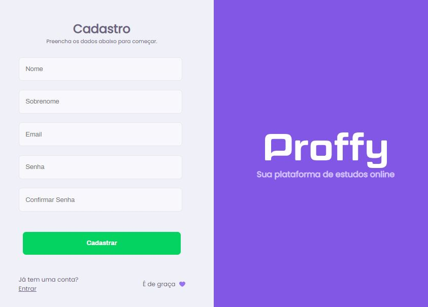

## About 

Esta é a parte Web versão 2.0 da aplicação feita pela rocketseat desenvolvida utilizando o React e o TypeScript, onde o usuario vai poder se cadastrar no site e ter duas opções, se tornar um proffy de acordo com as categorias inseridas ou tomar uma aula por um de nossos Proffys. 
O objetivo do app é criar conexões entre profissionais da área e pessoas que querem aprender sobre os determinados assuntos.
    
## Images

### Landing
O usuario vai só poder acessar a landing estando autenticado, assim ele vai poder ter acesso as duas funcionalidade que a pagina oferece, a pagina de estudar e a pagina de dar aulas

### Login / Register
Secção onde o usuario vai poder logar, cadastrar e resertar a senha

### Teacher Form
Onde o usuario vai se cadastrar para poder se tornar um Proffy

### Teacher List
Listagem dos proffys, o usuario tambem poderá filtrar os proffys pela materia, dia ou hora.

